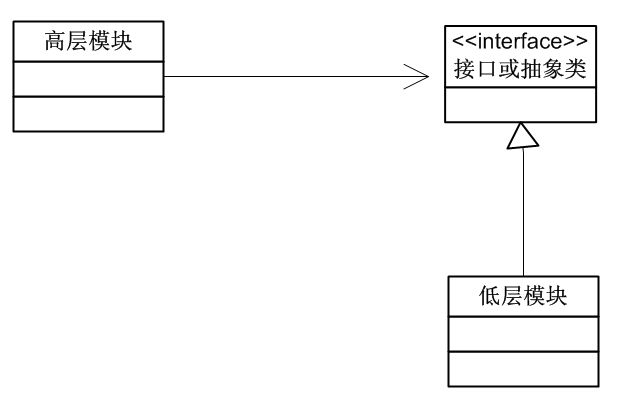

#设计模式的几种原则

##一. 里氏代换原则

>定义：

子类型必须能够替换它们的父类型。[DH]

>解释：

也就是说，在软件里面，把父类都替换成子类，程序的行为没有变化。也只有这样父类才能真正被复用，而子类也能够在父类的基础上增加新的行为。这个原则是对继承的一个约束，也就是说，继承中子类严格满足"is-a"的关系。

所以，当你看到一个继承的时候，要习惯性的把他的父类和子类看成一个整体，这样会有助于你去理解各个类之间的关系。

由于里氏代换的原则，才使得开放－封闭成为了可能。正是由于子类型的可替换性才使得父类类型的模块在无需修改的情况下就可以扩展。

>例如：

这个继承关系就不满足里氏代换原则。

##二. 单一职责原则

>定义：

就一个类而言，应该仅有一个引起他变化的原因。[DH]

>解释：

也就是说，不要把变化原因各不相同的职责放在一起，因为不同的变化会影响到不相干的职责。

再通俗一点地说就是，不该你管的事情你不要管， 管好自己的事情就可以了，多管闲事害了自己也害了别人。

这个就是说，一个类尽量做到了功能单一，比如在mvc中，判断数据的类和添加数据库的类一定要分开。单一职能不是说职能多了我们实现不了，是为了后期的测试维护，每个类的很单一，我们找错误的时候就可以一步到位，添加新的功能的时候，也不用牵扯到很多的类。

##三. "开放-封闭"原则

>定义：

是说软件实体(类，模块，函数等)应该可以扩展，但是不可以修改。 [DH]
解释：
意思是，在一个系统中，对于扩展是开放的，对于修改是关闭的，一个好的系统是在不修改源代码的情况下，可以扩展你的功能。

而实现开闭原则的关键就是抽象化。
在"开放－封闭"原则中，不允许修改的是抽象的类或者接口，允许扩展的是具体的实现类，抽象类和接口在"开放－封闭"原则中扮演着极其重要的角色，即要预知可能变化的需求，又预见所有可能已知的扩展，所以在这里"抽象化"是关键！
当然对于修改，我们不可能完全避免，也不可能完全预知到未来的变化，所以我们要做到尽量去不要修改，或者少的修改就能达到我们的目标。一旦要修改，就要充分的考虑出以后要发生的变化，然后构造抽象来隔离这些变化。

最后不要刻意地进行抽象，拒绝不成熟的抽象也是很重要的。

##四. 依赖倒转原则

>案例：

比如，我们做的项目大多要访问数据库，所以我们就把访问数据库的代码写成了函数，每次做新项目时就去调用这些函数。这就叫做高层模块依赖低层模块。

>问题：

当客户希望使用不同的数据库时，就会出现麻烦。因为当我们希望再次利用这些高层模块，但高层模块都与低层的访问数据库绑定在一起的，也就没有办法复用这些高层模块了。

>说明：

如果不管高层模块还是低层模块，它们都依赖于抽象，具体一点就是接口或抽象类，只要接口是稳定的，那么任何一个的更改都不用担心其它受到影响，这就使得无论高层模块还是低层模块都可以很容易地被复用。

>定义：

A：高层模块不应该依赖底层模块,两个者应该依赖抽象。
B：抽象不应该依赖细节，细节应该依赖抽象。[DH]

>解释：

也就是说，要针对接口或抽象进行编程，不要对实现编程。
通俗的说就是，谁也不要依靠谁，除了约定的接口或抽象类。只有抽象的东西才是最稳定的，也就是说，我们依赖的是它的稳定。如果将来“抽象”也不稳定了，那么谁稳定我跟谁！

##五. 组合/聚合复用原则

>定义：

尽量使用组合/聚合，尽量不要使用类继承。

>解释：

优先使用组合/聚合将有助于你保持每个类被封装，并被集中在单个任务上。这样类和类的继承层次会保持较小规模，并且不太可能增长为不可控制的庞然大物。

>举例：

可以看一下桥接(Bridge)模式的实现，这个模式是典型的组合/聚合复用原则的应用。

##六. 迪米特法则

>定义：

如果两个类不必彼此直接通信，那么这两个类就不应当直接的相互作用。如果其中一个类需要调用另一个类的某一个方法的话，可以通过第三者转发这个调用。

>解释：

这个法则强调的前提是，在类的结构设计上，每一个类都应当尽量降低成员的访问权限。

其根本思想是，强调了类之间的松耦合。

类之间的耦合越弱，越有利于复用，一个处在弱耦合的类被修改，不会对有关系的类造成涉及。

##七. 最后总结一下：

1. "开放－封闭"原则是设计模式的核心目标。
2. 依赖倒转原则是到达"开放－封闭"原则的手段。
3. 里氏代换原则使得"开放－封闭"成为了可能。
4. 对于单个类设计来说，单一职责原则和迪米特法则是我们要时刻关注的。