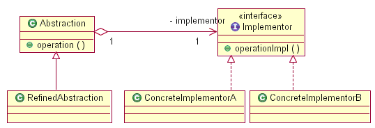

#Bridge模式

##作用：

将抽象部分与它的实现部分分离，使它们都可以独立地变化。

##UML结构图：

##抽象基类：
1. Abstraction：某个抽象类，它的实现方式由Implementor完成。
2. Implementor：实现类的抽象基类，定义了实现Abastraction的基本操作，而它的派生类实现这些接口。

##接口函数：

Implementor：：OperationImpl：定义了为实现Abstraction需要的基本操作，由Implementor的派生类实现之，而在Abstraction：：Operation函数中根据不同的指针多态调用这个函数。

##解析：

Bridge用于将表示和实现解耦，两者可以独立的变化。在Abstraction类中维护一个Implementor类指针，需要采用不同的实现方式的时候只需要传入不同的Implementor派生类就可以了。

Bridge的实现方式其实和Builde十分的相近，可以这么说：本质上是一样的，只是封装的东西不一样罢了。两者的实现都有如下的共同点：抽象出来一个基类，这个基类里面定义了共有的一些行为，形成接口函数(对接口编程而不是对实现编程)，这个接口函数在Buildier中是BuildePart函数在Bridge中是OperationImpl函数;其次，聚合一个基类的指针，如Builder模式中Director类聚合了一个Builder基类的指针，而Brige模式中Abstraction类聚合了一个Implementor基类的指针(优先采用聚合而不是继承);而在使用的时候，都把对这个类的使用封装在一个函数中，在Bridge中是封装在Director：：Construct函数中，因为装配不同部分的过程是一致的，而在Bridge模式中则是封装在Abstraction：：Operation函数中，在这个函数中调用对应的Implementor：：OperationImpl函数。就两个模式而言，Builder封装了不同的生成组成部分的方式，而Bridge封装了不同的实现方式。

因此，如果以一些最基本的面向对象的设计原则来分析这些模式的实现的话，还是可以看到很多共同的地方的。

