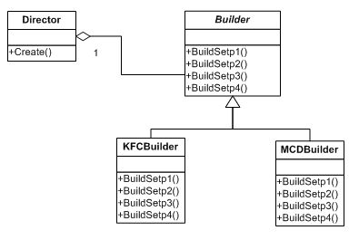

#建造者(Builder)模式

##一. 概述

Builder 模式要解决的问题是：当我们要创建的对象很复杂的时候（通常是由很多其他的对象组合而成），我们要要复杂对象的创建过程和这个对象的表示（展示）分离开来，这样做的好处就是通过一步步的进行复杂对象的构建，由于在每一步的构造过程中可以引入参数，使得经过相同的步骤创建最后得到的对象的展示不一样。

##二. 举例

KFC 与 Mcdonalds 的汉堡生成过程大致都是一样的，假设分为4个步骤；

但是 KFC 与 Mcdonalds 的汉堡味道有所差别，主要是在每一步的细节上有所不同。

顾客要吃汉堡并不关心具体的生产步骤，其实汉堡店也不关心，因为数百年来，这些步骤者是相同的，差别只在细节上。比如盐放多少，辣椒放多少等等。

结构如下：

>Builder：为最基本的生产步骤

>KFCBuilder：为KFC的具体生产步骤

>MCDBuilder：为Mcdonalds的具体生产步骤

>Director：为指挥者，用它来控件建造过程

##三. 说明

1. 建造者模式，在建造顺序上通常是稳定的。
2. 指挥者(Director)，来隔离用户与具体建造过程的关联。

3. 它的好处是，客户端不需要知道具体的建造者方法，也不用但心忘记某一步骤没写，这些步骤统一由Director来调用。