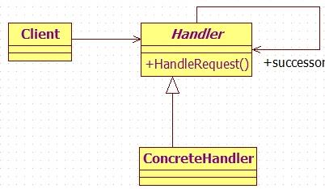
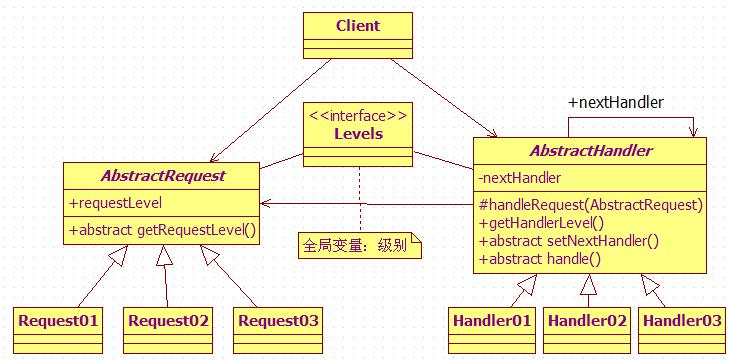

#职责链(Chain of Responsibility)模式

##一. 概述

使多个对象都有机会处理请求，从而避免请求的发送者和接收者之间的耦合关系。将这些对象连成一条链，并沿着这条链传递该请求，直到有一个对象处理它为止。

##适用场景：
1. 有多个的对象可以处理一个请求，哪个对象处理该请求运行时刻自动确定；
2. 在不明确指定接收者的情况下，向多个对象中的一个提交一个请求；
3. 处理一个请求的对象集合应被动态指定。

##通用类图：

在大学里面当班干部，时常要向上级申请各方面的东西。譬如申请全班外出秋游，普通同学将申请表交给班长，班长签字之后交给辅导员，辅导员批准之后上交到主任办公室…就是这样，一个请求（这里是一份申请表）有时候需要经过好几个级别的处理者（这里是辅导员、主任）的审查才能够最终被确定可行与否。
在这里表现出来的是一个职责链，即不同的处理者对同一个请求可能担负着不同的处理方式、权限，但是我们希望这个请求必须到达最终拍板的处理者（否则秋游就没戏了）。这种关系就很适合使用职责链模式了。
###类图结构如下：

##三. 说明

1. 职责链的特点是：当客户提交一个请求时，请求是沿链传递直至有一个ConcreteHandler对象负责处理它。
2. 职责链的好处是：请求者不用管哪个对象来处理，反正该请求会被处理。它只需保持一个后继者即可。
3. 要注意的是：一个请求到链的最后可能也没有处理，所以一定要配置得当。

##不足之处：
1. 对于每一个请求都需要遍历职责链，性能是个问题；
2. 抽象处理者 AbstractHandler 类中的 handleRequest() 方法中使用了递归，栈空间的大小也是个问题。

##个人看法：
职责链模式对于请求的处理是不知道最终处理者是谁，所以是运行动态寻找并指定；而命令模式中对于命令的处理时在创建命令是已经显式或隐式绑定了接收者。