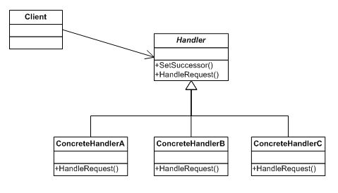

#职责链(Chain of Responsibility)模式

##一. 概述

职责链模式：

使多个对象都有机会处理请求，从而避免请求的发送者和接收者之间的耦合关系。将这些对象连成一条链，并沿着这条链传递该请求，直到有一个对象处理它为止。

##二. 举个例子

员工要求加薪

公司的管理者一共有三级：总经理、总监、经理，如果一个员工要求加薪，应该向主管的经理申请，如果加薪的数量在经理的职权内，那么经理可以直接批准，否则将申请上交给总监。总监的处理方式也一样，总经理可以处理所有请求。这就是典型的职责链模式，请求的处理形成了一条链，直到有一个对象处理请求。
结构图如下：

假设：
经理可以处理薪水的范围在：0~500
总监可以处理薪水的范围在：500~1000
总经理可以处理薪水的范围在：1000~2000
[见代码]

##三. 说明

1. 职责链的特点是：当客户提交一个请求时，请求是沿链传递直至有一个ConcreteHandler对象负责处理它。
2. 职责链的好处是：请求者不用管哪个对象来处理，反正该请求会被处理。它只需保持一个后继者即可。
3. 要注意的是：一个请求到链的最后可能也没有处理，所以一定要配置得当。