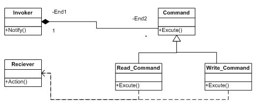
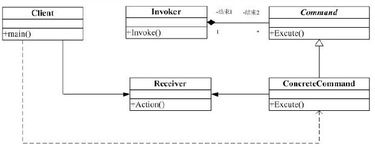

#命令(Command)模式

##一. 举例说明

我们知道，在多线程程序中，多个用户都给系统发 Read 和 Write 命令。这里有几点需要说明：

1. 首先明确一点，所有的这些 Read 和 Write 命令都是调用一个库函数。
2. 用户并不需要知道别的用户的存在，也不管别人发不发命令，只管自己发命令，最后给结果即可。
3. 这些命令先是到了一个消息队列里面，然后由消息队列调用库函数。
结构图如下：

##二. 命令模式

定义：将一个请求封装为一个对象，从而使你可用不同的请求对客户时行参数化;对请求排队或记录请求日志，以及支持可撤销的操作。

###命令模式中主要角色
* 命令（Command）角色：声明了一个给所有具体命令类的抽象接口。这是一个抽象角色。
具体命令（ConcreteCommand）角色：定义一个接受者和行为之间的弱耦合；实现Execute()方法，负责调用接收考的相应操作。Execute()方法通常叫做执行方法。
* 客户（Client）角色：创建了一个具体命令(ConcreteCommand)对象并确定其接收者。
* 请求者（Invoker）角色：负责调用命令对象执行请求，相关的方法叫做行动方法。
* 接收者（Receiver）角色：负责具体实施和执行一个请求。任何一个类都可以成为接收者，实施和执行请求的方法叫做行动方法。

###优点：

1. 它能比较容易地设计一个命令队列。
2. 在需要的情况下，可以较容易地将命令记入日志。
3. 允许接收请求的一方决定是否要否决请求。
4. 可以容易地实现对请求的撤销和重做。
5. 增加新的具体命令类很容易
6. 把请求一个操作的对象(Command)与知道怎么执行一个操作的对象(Receiver)分割开来。

##三. 应用场景

在下面的情况下应当考虑使用命令模式：

1. 使用命令模式作为"CallBack"在面向对象系统中的替代。"CallBack"讲的便是先将一个函数登记上，然后在以后调用此函数。
2. 需要在不同的时间指定请求、将请求排队。一个命令对象和原先的请求发出者可以有不同的生命期。换言之，原先的请求发出者可能已经不在了，而命令对象本身仍然是活动的。这时命令的接收者可以是在本地，也可以在网络的另外一个地址。命令对象可以在串形化之后传送到另外一台机器上去。
3. 系统需要支持命令的撤消(undo)。命令对象可以把状态存储起来，等到客户端需要撤销命令所产生的效果时，可以调用undo()方法，把命令所产生的效果撤销掉。命令对象还可以提供redo()方法，以供客户端在需要时，再重新实施命令效果。
4. 如果一个系统要将系统中所有的数据更新到日志里，以便在系统崩溃时，可以根据日志里读回所有的数据更新命令，重新调用Execute()方法一条一条执行这些命令，从而恢复系统在崩溃前所做的数据更新。