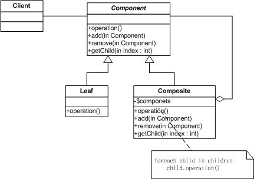
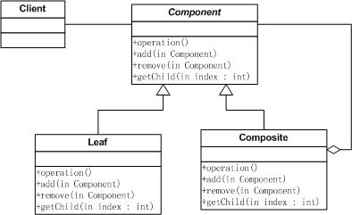

#Composite 模式

##作用：

将对象组合成树形结构以表示“部分-整体”的层次结构。Composite使得用户对单个对象和组合对象的使用具有一致性。

##UML结构图：

###合成模式中主要角色
* 抽象组件(Component)角色：抽象角色，给参加组合的对象规定一个接口。在适当的情况下，实现所有类共有接口的缺省行为。声明一个接口用于访问和管理Component的子组件
* 树叶组件(Leaf)角色：在组合中表示叶节点对象，叶节点没有子节点。在组合中定义图元对象的行为。
* 树枝组件(Composite)角色：存储子部件。定义有子部件的那些部件的行为。在Component接口中实现与子部件有关的操作。
* 客户端(Client)：通过Component接口操纵组合部件的对象

##抽象基类：

Component：为组合中的对象声明接口，声明了类共有接口的缺省行为(如这里的Add，Remove，GetChild函数)，声明一个接口函数可以访问Component的子组件。
　　
###接口函数：

1. Component：：Operatation：定义了各个组件共有的行为接口，由各个组件的具体实现。
2. Component：：Add添加一个子组件
3. Component：：Remove：：删除一个子组件。
4. Component：：GetChild：获得子组件的指针。

##解析：

Component模式是为解决组件之间的递归组合提供了解决的办法，它主要分为两个派生类，其中的Leaf是叶子结点，也就是不含有子组件的结点，而Composite是含有子组件的类。举一个例子来说明这个模式，在UI的设计中，最基本的控件是诸如Button，Edit这样的控件，相当于是这里的Leaf组件，而比较复杂的控件比如List则可也看做是由这些基本的组件组合起来的控件，相当于这里的Composite，它们之间有一些行为含义是相同的，比如在控件上作一个点击，移动操作等等的，这些都可以定义为抽象基类中的接口虚函数，由各个派生类去实现之，这些都会有的行为就是这里的Operation函数，而添加，删除等进行组件组合的操作只有非叶子结点才可能有，所以虚拟基类中只是提供接口而且默认的实现是什么都不做。

##Composite模式的优点
1. 简化客户代码
2. 使得更容易增加新类型的组件
##Composite模式的缺点：
使你的设计变得更加一般化，容易增加组件也会产生一些问题，那就是很难限制组合中的组件

##合成模式适用场景
1. 你想表示对象的部分-整体层次结构
2. 你希望用户忽略组合对象和单个对象的不同，用户将统一地使用组合结构中的所有对象。

##合成模式与其它模式
* 装饰器模式：Decorator模式经常与Composite模式一起使用。当装饰与合成一起使用时，它们通常有一个公共的父类。因此装饰必须支持具有add,remove和getChild操作的Component接口
* 享元模式：Flyweight模式让你共享组件，但不再引用他们的父部件
* 迭代器模式：Itertor可用来遍历Composite
* 访问者模式：Visitor将本来应该分布在Composite和Leaf类中的操作和行为局部化。

##安全式的合成模式
在Composite类里面声明所有的用来管理子类对象的方法。这样的做法是安全的。因为树叶类型的对象根本就没有管理子类的方法，因此，如果客户端对树叶类对象使用这些方法时，程序会在编译时期出错。编译通不过，就不会出现运行时期错误
这样的缺点是不够透明，因为树叶类和合成类将具有不同的接口。

##透明式的合成模式
在Composite类里面声明所有的用来管理子类对象的方法。这样做的是好处是所有的组件类都有相同的接口。在客户端看来，树叶类和合成类对象的区别起码在接口层次上消失了，客户端可以同等的对待所有的对象。这就是透明形式的合成模式
缺点就是不够安全，因为树叶类对象和合成类对象在本质上是有区别的。树叶类对象不可能有下一个层次的对象，因此调用其添加或删除方法就没有意义了，这在编译期间是不会出错的，而只会在运行时期才会出错。

