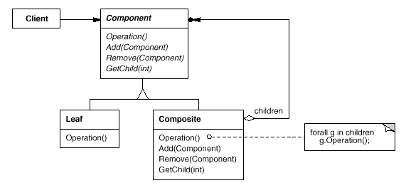

#Composite 模式

##作用：

将对象组合成树形结构以表示“部分-整体”的层次结构。Composite使得用户对单个对象和组合对象的使用具有一致性。

##UML结构图：

##抽象基类：

Component：为组合中的对象声明接口，声明了类共有接口的缺省行为(如这里的Add，Remove，GetChild函数)，声明一个接口函数可以访问Component的子组件。
　　
###接口函数：

1. Component：：Operatation：定义了各个组件共有的行为接口，由各个组件的具体实现。
2. Component：：Add添加一个子组件
3. Component：：Remove：：删除一个子组件。
4. Component：：GetChild：获得子组件的指针。

##解析：

Component模式是为解决组件之间的递归组合提供了解决的办法，它主要分为两个派生类，其中的Leaf是叶子结点，也就是不含有子组件的结点，而Composite是含有子组件的类。举一个例子来说明这个模式，在UI的设计中，最基本的控件是诸如Button，Edit这样的控件，相当于是这里的Leaf组件，而比较复杂的控件比如List则可也看做是由这些基本的组件组合起来的控件，相当于这里的Composite，它们之间有一些行为含义是相同的，比如在控件上作一个点击，移动操作等等的，这些都可以定义为抽象基类中的接口虚函数，由各个派生类去实现之，这些都会有的行为就是这里的Operation函数，而添加，删除等进行组件组合的操作只有非叶子结点才可能有，所以虚拟基类中只是提供接口而且默认的实现是什么都不做。