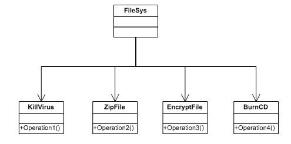
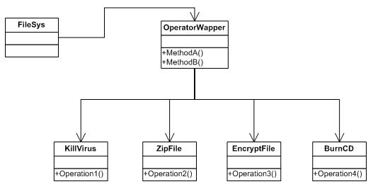
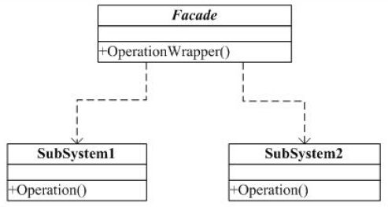

#外观(Facade)模式

##一. 举例说明

还以我以前做的文件系统(FileSys)为例：

文件系统是一个独立的系统，它提供一套核心的文件操作。

除了文件系统，还有四个子系统，分别是杀毒子系统(KillVirus)，压缩子系统(ZipFile)，加密子系统(EncrypeFile)和刻录子系统(BurnCD)，这四个子系统相互独立，但又可以做为主系统功能的一部分。

假设客户需要我这个文件系统有两种执行模式，一种是完全模式，一种是简单模式。

完全模式，要求杀毒子，压缩，加密和刻录功能都有。
简单模式，要求只要有杀毒，刻录就行了。

###第一种设计：

文件系统自己管理所有的子系统，并实现客户的需求。

最开始的话，我们是按上面的结构来设计的，这个文件系统(FileSys)就要自己管理和组织上面的四个子系统。问题是子系统变化比较多，特别是重构之后，接口也变了，这时也要相应的修改这个文件系统。最麻烦的是，有时一个子系统要分离出好多小类，这对子系统是好事，但是对FileSys来说，调用越来越复杂和困难了。
这种设计的问题是：文件系统和子系统耦合性太高了！

###第二种设计：

后来我们独立出一个中间层，由中间层来统一管理这些子系统，并对外提供相对简单的接口，使它们之间减少依赖。

##二. 外观模式

###定义：
为子系统中的一组接口提供一个一致的界面， 外观模式定义了一个高层接口，这个接口使得这一子系统更加容易使用。

简单的说，就是分层的概念。

说明：
1. 在设计初期，应该有意识的将不同层分离，比如常用的三层架构，就是考虑在数据访问层，业务逻辑层与表示层之间，建立Facade，使复杂的子系统提供一个简单的接口，降低耦合性。

2. 在开发阶段，子系统往往因为不断的重构而变的越来越复杂，增加外观Facade可以提供一个简单的接口，减少它们之间的依赖。
3. 在维护阶段，可能这个系统已经非常难以维护和扩展了，此时你可以为新系统开发一个外观类，来提供设计粗糙或高度复杂的遗留代码的比较清晰简单的接口，让新系统与Facade对象交互，Facade与遗留代码交互所有复杂的工作。

##门面模式与其它模式
抽象工厂模式(abstract factory模式)：Abstract Factory模式可以与Facade模式一起使用以提供一个接口，这一接口可用来以一种子系统独立的方式创建子系统对象。Abstract Factory模式也可以代替Facade模式隐藏那些与平台相关的类

调停者模式：Mediator模式与Facade模式的相似之处是，它抽象了一些已有类的功能。然而，Mediator目的是对同事之间的任意通讯进行抽象，通常集中不属于任何单个对象的功能。

Mediator的同事对象知道中介者并与它通信，而不是直接与其他同类对象通信。相对而言，
Facade模式仅对子系统对象的接口进行抽象，从而使它们更容易使用；它并定义不功能，子系统也不知道facade的存在

单例模式(singleton模式)：一般来说，仅需要一个Facade对象，因此Facade对象通常属于Singleton对象。