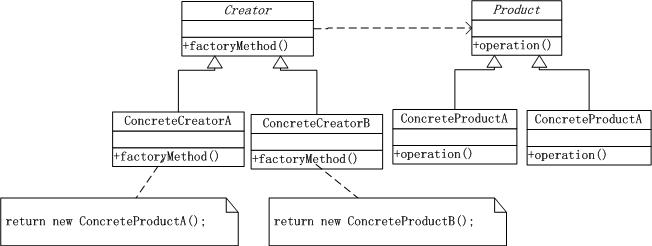
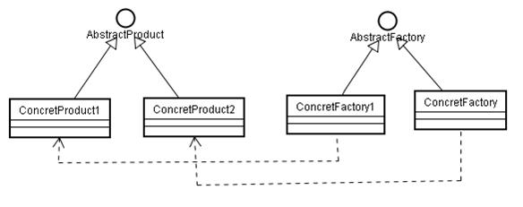
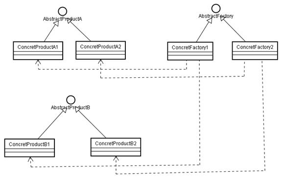

#工厂方法模式

##意图
定义一个用于创建对象的接口，让子类决定实例化哪一个类。Factory Method使用一个类的实例化延迟到其子类

##工厂模式结构图

##工厂模式中主要角色
* 抽象产品(Product)角色：具体产品对象共有的父类或接口
* 具体产品(Concrete Product)角色：实现抽象产品角色所定义的接口，并且工厂方法模式所创建的每一个对象都是某具体产品对象的实例
* 抽象工厂(Creator)角色：模式中任何创建对象的工厂类都要实现这个接口，它声明了工厂方法，该方法返回一个Product类型的对象。
* Creator也可以定义一个工厂方法的缺省实现，它返回一个缺省的的ConcreteProduct对象
* 具体工厂(Concrete Creator)角色：实现抽象工厂接口，具体工厂角色与应用逻辑相关，由应用程序直接调用以创建产品对象。

##工厂模式的优点和缺点

###工厂模式的优点

工厂方法模式可以允许系统在不修改工厂角色的情况下引进新产品。

###工厂模式的缺点

客户可能仅仅为了创建一个特定的ConcreteProduct对象，就不得不创建一个Creator子类

##工厂模式适用场景
1. 当一个类不知道它所必须创建的对象的类的时候
2. 当一个类希望由它的子类来指定它所创建的对象的时候
3. 当类将创建对象的职责委托给多个帮助子类的某一个，并且你希望将哪一个帮助子类是代理者这一信息局部化的时候

##工厂模式与其它模式
* 抽象工厂模式(abstract factory模式)：Abstract Factory模式经常使用工厂方法来实现
* Template Method模式: 工厂方法通常在Template Methods中被调用

##工厂方法模式与简单工厂模式
工厂方法模式与简单工厂模式再结构上的不同不是很明显。工厂方法类的核心是一个抽象工厂类，而简单工厂模式把核心放在一个具体类上。

工厂方法模式之所以有一个别名叫多态性工厂模式是因为具体工厂类都有共同的接口，或者有共同的抽象父类。

当系统扩展需要添加新的产品对象时，仅仅需要添加一个具体对象以及一个具体工厂对象，原有工厂对象不需要进行任何修改，也不需要修改客户端，很好的符合了”开放－封闭”原则。而简单工厂模式在添加新产品对象后不得不修改工厂方法，扩展性不好。

工厂方法模式退化后可以演变成简单工厂模式。

工厂方法模式是对简单工厂模式的改进。首先看看简单工厂模式的缺点。

软件是之所以区别于程序，是因为它可以被人们使用，并能间接创造效益。需求是软件开发的核心，忽视用户的需求，软件本身就没有存在的价值。

假如Nokia又新开发了一款新手机N99，对于采用简单工厂模式设计的系统，我们的做法是：

1. 新增一个CN99类继承自CNokia抽象类，这个符合OCP原则。
注：OCP:Open-Closed Principle开闭原则。OCP关注的是灵活性，改动是通过增加代码进行的，而不是改动现有的代码。对扩展开放，对修改关闭。
2. 修改静态工厂方法中的判断逻辑，增加对N99的创建代码。这个明显违背OCP。

改进简单工厂模式，我们要做的就是克服2中的缺点。

下面的工厂方法模式，新增一个N96的工厂类，不用修改已有的代码，完全支持OCP原则，而且工厂方法模式也完全遵守里氏替换原则，LSP原则是OCP成为可能的重要原则。

>注：Liskov Substitution Principle（里氏代换原则）：子类型(subtype)必须能够替换它们的基类型。

虽然工厂方法模式是对简单工厂模式缺点的该进，这个缺点就是违背软件设计原则OCP。但是并不是工厂方法模式就优于简单工厂模式，只不过后者更符合常规的软件设计理念。 

##UML
###工厂方法:

###抽象工厂:

##4. 应用场景

###工厂方法：

在以下情况下，适用于工厂方法模式：

1. 当一个类不知道它所必须创建的对象的类的时候。
2. 当一个类希望由它的子类来指定它所创建的对象的时候。
3. 当类将创建对象的职责委托给多个帮助子类中的某一个，并且你希望将哪一个帮助子类是代理者这一信息局部化的时候。

###抽象工厂：

1. 一个系统不应当依赖于产品类实例如何被创建、组合和表达的细节，这对于所有形态的工厂模式都是重要的。
2. 这个系统有多于一个的产品族，而系统只消费其中某一产品族。
3. 同属于同一个产品族的产品是在一起使用的，这一约束必须在系统的设计中体现出来。
4. 系统提供一个产品类的库，所有的产品以同样的接口出现，从而使客户端不依赖于实现。