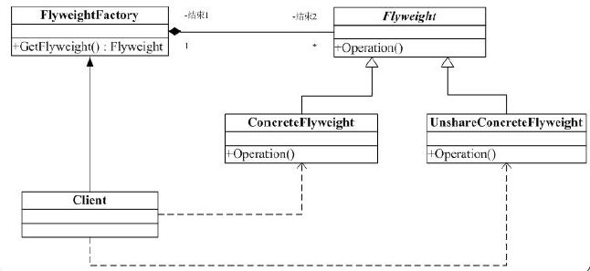

#享元(Flyweight)模式

##一. 概述

在面向对象系统的设计何实现中，创建对象是最为常见的操作。

这里面就有一个问题：如果一个应用程序使用了太多的对象，就会造成很大的存储开销。特别是对于大量轻量级（细粒度）的对象，比如在文档编辑器的设计过程中，我们如果没有为字母创建一个对象的话，系统可能会因为大量的对象而造成存储开销的浪费。

例如一个字母“a”在文档中出现了100000次，而实际上我们可以让这一万个字母“a”共享一个对象，当然因为在不同的位置可能字母“a”有不同的显示效果（例如字体和大小等设置不同），在这种情况我们可以为将对象的状态分为“外部状态”和“内部状态”，将可以被共享（不会变化）的状态作为内部状态存储在对象中，而外部对象（例如上面提到的字体、大小等）我们可以在适当的时候将外部对象最为参数传递给对象（例如在显示的时候，将字体、大小等信息传递给对象）。

##二. 享元模式

定义：运用共享技术有效地支持大量细粒度的对象。
结构图如下：

Flyweight：所有具体享元类的父类，或接口

ConcreteFlyweight：具体享元类，实现具体的操作

UnshareConcreteFlyweight：不需要共享的子类

FlyweightFactory：合理的创建并管理享元类
三. 说明

1. 享元工厂类是重点，因为它创建并管理享元对象，对没有的对象它会创建，对已有的对象它会提供一个已创建的实例。

2. 可以想像有一个对象池，里面都是一些享元类，享元工厂的作用就是从对象池里取对象。

3. 它的目的是大幅度地减少需要实例化的类的数量。