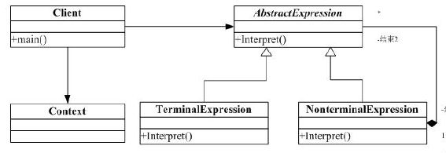

#解释器(Iterpreter)模式

##一. 解释器模式
>定义：给定一个语言，定义它的文法的一种表示，并定一个解释器，这个解释器使用该表示来解释语言中的句子。

结构如下：

##二. 说明
解释器模式就是用“迷你语言”来表现程序要解决的问题。

比如：在C语言解释器，当你输入 int 时，解释器就能正确的开辟一个 int 的空间出来。

再比如： linux 下常用的命令参数，如 ls -a，-a 就能被正确的解释成相应的命令。

优点：这种模式很容易改变和扩展文法，因为每个文法有一个文法类，也就是上面的表达式类。

缺点：当文法非常复杂时，要管理和维护很多个文法类。