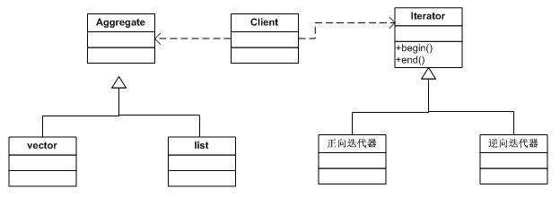
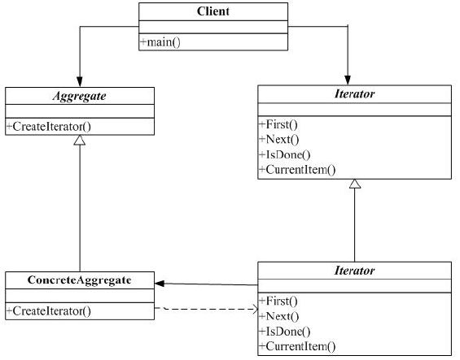

#迭代器(Iterator)模式

##一. 举例说明

我们知道，在 STL 里提供 Iterator 来遍历 Vector 或者 List 数据结构。

Iterator 模式也正是用来解决对一个聚合对象的遍历问题，将对聚合的遍历封装到一个类中进行，这样就避免暴露这个聚合对象的内部表示的可能。

例如在 STL 里有如相下结构：

##二. 迭代器模式

定义：提供一种方法顺序访问一个聚合对象中各个元素，而又不暴露该对象的内部表示。

比较经典的例子是 STL 里的 for_each 操作：