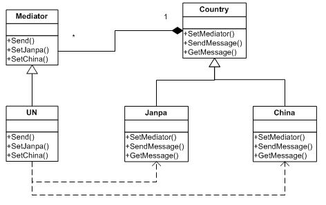
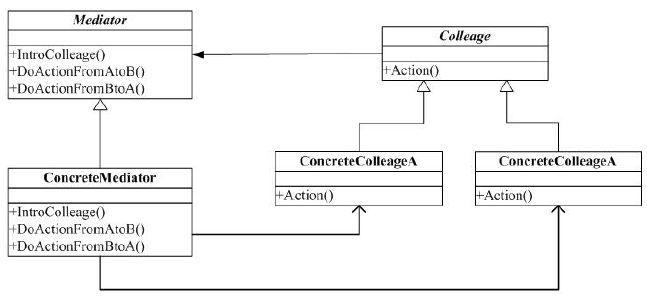

#中介者(Mediator)模式
 
##一. 举例

比如，现在中图和日本在关于钓鱼岛问题上存在争端。这时，联合国就会站出来，做为调解者，其实也没什么好调解的，钓鱼岛本来就是中国的，这是不争的事实！联合国也就是个传话者、发言人。

结构图如下：

代码如下：

##二. 中介者模式

`定义`：用一个中介对象来封装一系列的对象交互。中介者使各对象不需要显式地相互引用，从而使其耦合松散，而且可以独立地改变它们之间的交互。

###说明：

1. Mediator 模式中，每个Colleague 维护一个 Mediator，当要进行通信时，每个具体的 Colleague 直接向ConcreteMediator 发信息，至于信息发到哪里，则由 ConcreteMediator 来决定。
2. ConcreteColleagueA 和 ConcreteColleagueB 不必维护对各自的引用，甚至它们也不知道各个的存在。
3. 优点是，各个 Colleague 减少了耦合。
4. 缺点是，由于 Mediator 控制了集中化，于是就把 Colleague 之间的交互复杂性变为了中介者的复杂性，也就是中介者会变的比任何一个 Colleague 都复杂。
