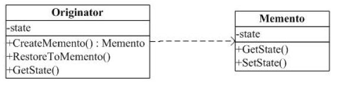

#备忘录(Memento)模式

##一. 备忘录模式

定义：在不破坏封装性的前提下，捕获一个对象的内部状态，并在该对象之外保存这个状态。这样以后就可将该对象恢复到原先保存的状态。

结构图：

###使用范围：

Memento 模式比较适用于功能比较复杂的，但需要维护或记录属性历史的类，或者需要保存的属性只是众多属性中的一小部分时，Originator 可以根据保存的 Memento 信息还原到前一状态。

代码：

##二. 说明

1. Memento 负责存储 Originator 对象的内部状态，并可防止 Originator 以外的其它对象访问备忘录（具体实现方法，就是让其所有方法都为私有的）。
2. Memento 声明 Originator 为它的友元类，这样 Originator 就可以访问它的所有函数，即对 Originator 是开放的。

我觉得，私有和友元是备忘录模式实现的关键！