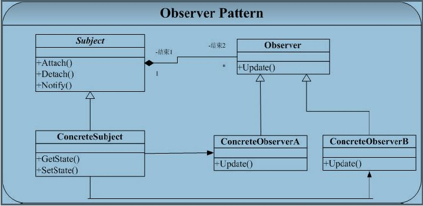
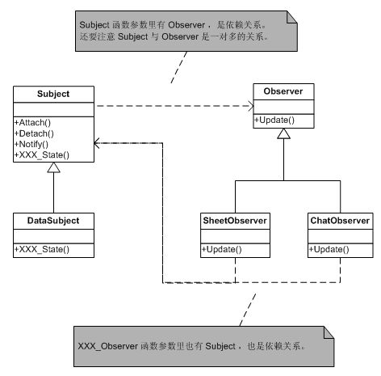
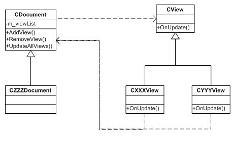

#观察者(Observer)模式

##一. 概述

Observer 模式要解决的问题为：建立一个一（Subject）对多（Observer）的依赖关系，并且做到当“一”变化的时候，依赖这个“一”的多也能够同步改变。

Sbuject 相当于通知者，它提供依赖于它的观察者Observer 的注册（Attach）和注销（Detach）操作，并且提供了使得依赖于它的所有观察者同步的操作（Notify）。
Observer 相当于观察者，则提供一个Update操作，注意这里的 Observer 的 Update 操作并不在Observer 改变了Subject目标状态的时候就对自己进行更新，这个更新操作要延迟到 Subject 对象发出 Notify 通知所有 Observer 进行修改（调用Update）。

##二. 举例

最常见的一个例子就是：对同一组数据进行统计分析时候，我们希望能够提供多种形式的表示（例如以表格进行统计显示、柱状图统计显示、百分比统计显示等）。这些表示都依赖于同一组数据，我们当然需要当数据改变的时候，所有的统计的显示都能够同时改变。

###结构关系图如下：

>DataSubject ： 我们就认为是原始数据。

>SheetObserver：就认为是表格，用来显示原始数据用的。

>ChartObserver ：就认为是图表，也是来显示原始数据的。

###代码如下：

###说明：

1. 在 Observer 模式的实现中，Subject 维护一个 list 作为存储其所有观察者的容器。每当调用 Notify 操作就遍历 list中的 Observer 对象，并广播通知改变状态（调用Observer的Update操作）。
2. 运行示例程序，可以看到当原始数据 Subject 处于状态 “old” 时候，依赖于它的两个观察者都显示 “old”，当原始数据状态改变为 “new” 的时候，依赖于它的两个观察者也都改变为“new”。
3. 可以看到 Observer 与 Subject 互为耦合，但是这种耦合的双方都依赖于抽象，而不依赖于具体。

##三. MFC中的观察者模式

MFC 的 View/Document 结构的实现中也采用了观察者模式。

Document 为模式中的通知者，管理应用程序中的数据，View为模式中的观察者，以给定的方显示所关联的 Document中的数据。CDocument类中定义了一个指针列表，用于保存对应的 CView 对象，并定义了一个函数用于对链表中的所有CView的对象进行更新。

###结构如下：

###原代码如下：

从代码中我们可以看到，AddView 和 RemoveView 相当于注册和注销操作，UpdateAllViews 相当于通知操作，通知操作会依次调用各个CView 对象的 OnUpdate，进行更新。
