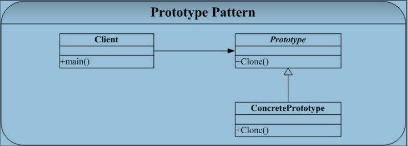

#原型(Prototype)模式

##一. 概述

定义：用原型实例指定创建对象的种类，并且通过拷贝这些原型创建新的对象。

换句话说，就是不用重新初始化对象，而是动态地获得对象运行时的状态。

再说明白点，就是要一个拷贝过构造函数类似功能的接口。
结构图如下：

##二. 说明

1. Prototype 模式的关键就是（C++中）拷贝构造函数的实现方式，这也是C++实现技术层面上的事情。
2. 示例代码中不涉及到深层拷贝（主要指有指针、复合对象的情况），主要在于体现Prototype模式的思想。