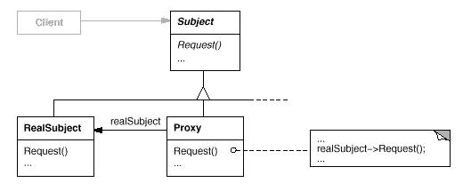

#Proxy模式

##作用：
　　
为其他对象提供一种代理以控制对这个对象的访问。
　　
##UML结构图：
　　

　　　　
##抽象基类：
　
Subject：定义了Proxy和RealSubject的公有接口，这样就可以在任何需要使用到RealSubject的地方都使用Proxy.
　　
##解析：
　　
Proxy其实是基于这样一种时常使用到的技术-某个对象直到它真正被使用到的时候才被初始化，在没有使用到的时候就暂时用Proxy作一个占位符。这个模式实现的要点就是Proxy和RealSubject都继承自Subject，这样保证了两个的接口都是一致的。