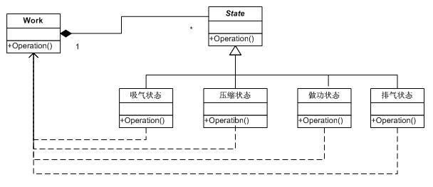
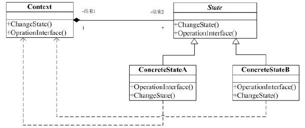

#状态(State)模式

状态模式(State Pattern)是设计模式的一种，属于行为模式。

>定义(源于Design Pattern)：当一个对象的内在状态改变时允许改变其行为，这个对象看起来像是改变了其类。

状态模式主要解决的是当控制一个对象状态的条件表达式过于复杂时的情况。把状态的判断逻辑转移到表示不同状态的一系列类中，可以把复杂的判断逻辑简化。

>意图：允许一个对象在其内部状态改变时改变它的行为

##一. 举例

一般汽车发动机工作时有四种状态，吸气、压缩、做功和排气。

在运行时，不同的状态会有不同的行为，当前的状态机在适当的时候会过渡到下一状态。

其实用户在使用时根本不知道当前的状态，也无需知道当前的状态。用户只需要给发动机一个初始状态，最后得到一个停止状态就行了。

###结构图如下：

###代码如下：

##二. 状态模式

定义：允许一个对象在其内部状态改变时改变它的行为。对象看起来似乎修改了它的类。

###结构图：

###适用场景：

1. 一个对象的行为取决于它的状态, 并且它必须在运行时刻根据状态改变它的行为。(上面的例子就是这种情况)
2. 一个操作中含有庞大的多分支的条件语句，且这些分支依赖于该对象的状态。