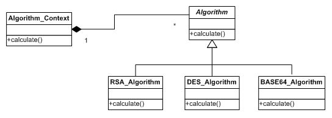
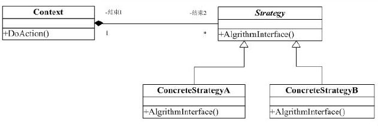

#策略(Strategy)模式

##一. 举例说明

以前做了一个程序，程序的功能是评价几种加密算法时间，程序的使用操作不怎么变，变的是选用各种算法。

###结构如下：

>Algorithm：抽象类，提供算法的公共接口。

>RSA_Algorithm：具体的RSA算法。

>DES_Algorithm：具体的DES算法。

>BASE64_Algorithm：具体的Base64算法。

在使用过程中，我只需要对外公布Algorithm_Context这个类及接口即可。

##一. 策略模式

###定义:

它定义了算法家族，分别封装起来，让它们之间可以互相替换，此算法的变化，不会影响到使用算法的客户。

这里的关键就是将算法的逻辑抽象接口（DoAction）封装到一个类中（Context），再通过委托的方式将具体的算法实现委托给具体的 Strategy 类来实现（ConcreteStrategeA类）。