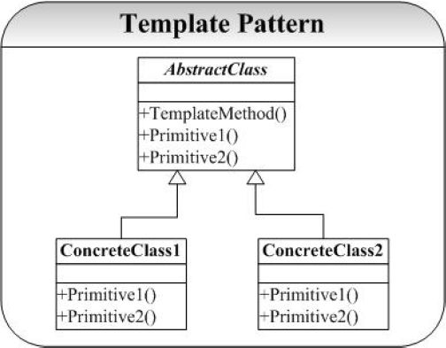

#模板(Template)模式

##一. 问题
在面向对象系统的分析与设计过程中经常会遇到这样一种情况：对于某一个业务逻辑（算法实现）在不同的对象中有不同的细节实现，但是逻辑（算法）的框架（或通用的应用算法）是相同的。Template提供了这种情况的一个实现框架。

##二. 模式

Template 模式是采用继承的方式实现这一点：将逻辑（算法）框架放在抽象基类中，并定义好细节的接口，子类中实现细节。

##三. 代码

其关键点就是将通用算法封装在抽象基类中，并将不同的算法细节放到子类中实现。