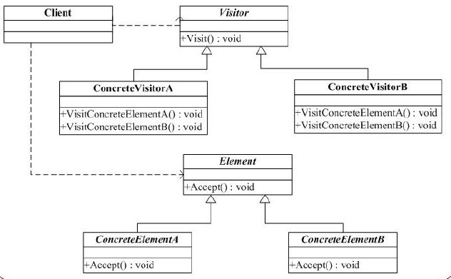
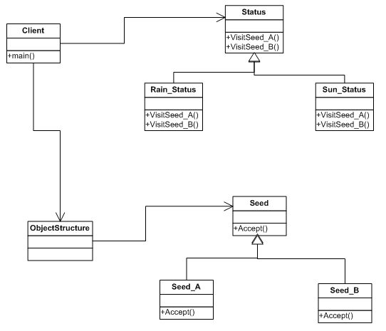

#访问者(Visitor)模式

一. 访问者模式

定义：表示一个作用于某对象结构中的各元素的操作。它你可以在不改变各元素的类的前提下定义作用于这些元素的新操作。

结构如下：

二. 举例

假设有一项科学实验，是用来对比两种种子在不同环境下的生长情况。

两种种子，一种是普通的种子(Seed_A)，一种是太空运回的种子(Seed_B)。

生长环境，分别是在多雨环境下(Rain_Status)，阳光环境下(Sun_Status)等等。

结构如下：

三. 说明

1. 首先有一点要明确，就是两种种子不会轻易改变，也就是只有普通和太空种子两种。换句话说就是，数据结构比较稳定。

2. 可以变的是新增的状态，比如增加一个X光下的生成情况，等等。说白了就是，操作集合可以相对自由的演化。

3. 这种结构的优点是，增加新的操作很容易；缺点是，增加新的数据结构有点困难，因为你要在每一个访问者里都添加相应的操作。

4. 种子生长图相对于访问者模式的结构图有如下关系：

seed（种子）相当于 element（元素），这个是不怎么变的。
status（状态） 相当于 visitor（访问者），这个是可变且易变的。要注意的是，每个访问者都要对所有的元素（element）进行操作。

5. 事实上我们很少用这种模式，因为数据结构（element）不变的情况很少。